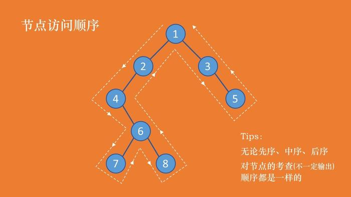
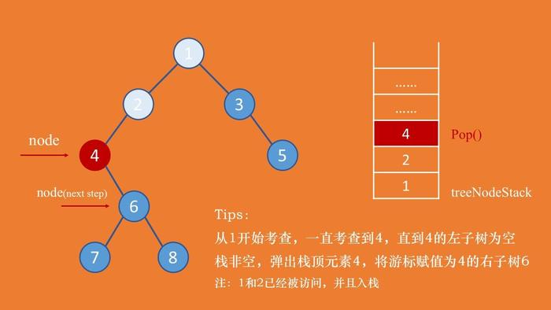
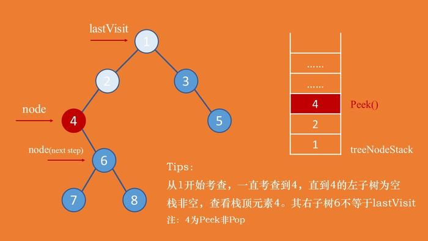
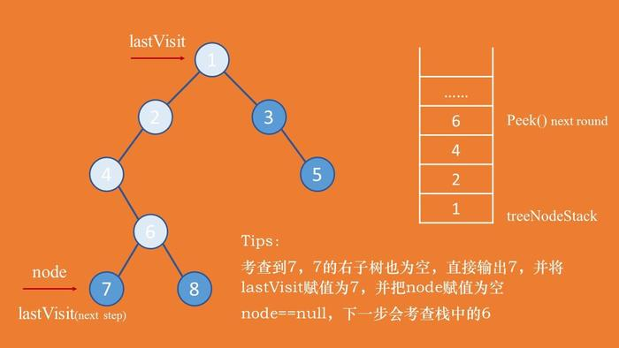
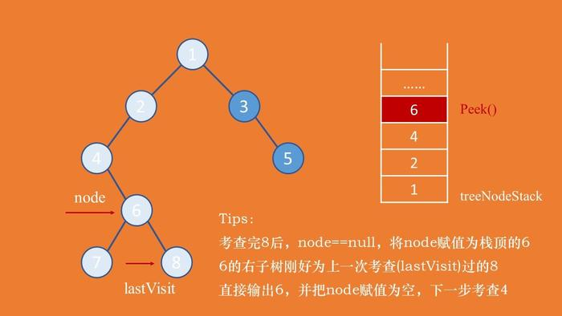

转载自：

1 [二叉树的广度优先遍历、深度优先遍历的递归和非递归实现方式](https://www.cnblogs.com/gl-developer/p/7259251.html)

2 [二叉树遍历(先序、中序、后序)](https://www.jianshu.com/p/456af5480cee)

# 二叉树的遍历方式：

1、深度优先：递归，非递归实现方式

- 先序遍历：先访问根节点，再依次访问左子树和右子树
- 中序遍历：先访问左子树，再访问根节点吗，最后访问右子树
- 后序遍历：先访问左子树，再访问右子树，最后访问根节点

2、广度优先

    //按照树的深度，一层一层的访问树的节点
    public class BinaryTree {

        // 二叉树节点
        public static class BinaryTreeNode {
            int value;
            BinaryTreeNode left;
            BinaryTreeNode right;

            public BinaryTreeNode(int value) {
                this.value = value;
            }

            public BinaryTreeNode(int value, BinaryTreeNode left,
                    BinaryTreeNode right) {
                super();
                this.value = value;
                this.left = left;
                this.right = right;
            }

        }

        // 访问树的节点
        public static void visit(BinaryTreeNode node) {
            System.out.println(node.value);
        }

        /** 递归实现二叉树的先序遍历 */
        public static void preOrder(BinaryTreeNode node) {
            if (node != null) {
                visit(node);
                preOrder(node.left);
                preOrder(node.right);
            }
        }

        /** 递归实现二叉树的中序遍历 */
        public static void inOrder(BinaryTreeNode node) {
            if (node != null) {
                inOrder(node.left);
                visit(node);
                inOrder(node.right);
            }
        }

        /** 递归实现二叉树的后序遍历 */
        public static void postOrder(BinaryTreeNode node) {
            if (node != null) {
                postOrder(node.left);
                postOrder(node.right);
                visit(node);
            }
        }

        /** 非递归实现二叉树的先序遍历 */
        public static void iterativePreorder(BinaryTreeNode node) {
            Stack<BinaryTreeNode> stack = new Stack<>();
            if (node != null) {
                stack.push(node);
                while (!stack.empty()) {
                    node = stack.pop();
                    // 先访问节点
                    visit(node);
                    // 把右子结点压入栈
                    if (node.right != null) {
                        stack.push(node.right);
                    }
                    // 把左子结点压入栈
                    if (node.left != null) {
                        stack.push(node.left);
                    }
                }
            }
        }

        /** 非递归实现二叉树的中序遍历 */
        public static void iterativeInOrder(BinaryTreeNode root) {
            Stack<BinaryTreeNode> stack = new Stack<>();
            BinaryTreeNode node = root;
            while (node != null || stack.size() > 0) {
                // 把当前节点的所有左侧子结点压入栈
                while (node != null) {
                    stack.push(node);
                    node = node.left;
                }
                // 访问节点，处理该节点的右子树
                if (stack.size() > 0) {
                    node = stack.pop();
                    visit(node);
                    node = node.right;
                }
            }
        }

        /** 非递归使用单栈实现二叉树后序遍历 */
        public static void iterativePostOrder(BinaryTreeNode root) {
            Stack<BinaryTreeNode> stack = new Stack<>();
            BinaryTreeNode node = root;
            // 访问根节点时判断其右子树是够被访问过
            BinaryTreeNode preNode = null;
            while (node != null || stack.size() > 0) {
                // 把当前节点的左侧节点全部入栈
                while (node != null) {
                    stack.push(node);
                    node = node.left;
                }
                if (stack.size() > 0) {
                    BinaryTreeNode temp = stack.peek().right;
                    // 一个根节点被访问的前提是：无右子树或右子树已被访问过
                    if (temp == null || temp == preNode) {
                        node = stack.pop();
                        visit(node);
                        preNode = node;// 记录刚被访问过的节点
                        node = null;
                    } else {
                        // 处理右子树
                        node = temp;
                    }
                }
            }
        }

        /** 非递归使用双栈实现二叉树后序遍历 */
        public static void iterativePostOrderByTwoStacks(BinaryTreeNode root) {
            Stack<BinaryTreeNode> stack = new Stack<>();
            Stack<BinaryTreeNode> temp = new Stack<>();
            BinaryTreeNode node = root;
            while (node != null || stack.size() > 0) {
                // 把当前节点和其右侧子结点推入栈
                while (node != null) {
                    stack.push(node);
                    temp.push(node);
                    node = node.right;
                }
                // 处理栈顶节点的左子树
                if (stack.size() > 0) {
                    node = stack.pop();
                    node = node.left;
                }
            }
            while (temp.size() > 0) {
                node = temp.pop();
                visit(node);
            }
        }

        /** 二叉树广度优先遍历——层序遍历 */
        public static void layerTraversal(BinaryTreeNode root) {
            Queue<BinaryTreeNode> queue = new LinkedList<>();

            if (root != null) {
                queue.add(root);
                while (!queue.isEmpty()) {
                    BinaryTreeNode currentNode = queue.poll();
                    visit(currentNode);
                    if (currentNode.left != null) {
                        queue.add(currentNode.left);
                    }

                    if (currentNode.right != null) {
                        queue.add(currentNode.right);
                    }

                }
            }
        }

        public static void main(String[] args) {

            // 构造二叉树
            // 1
            // / \
            // 2 3
            // / / \
            // 4 5 7
            // \ /
            // 6 8
            BinaryTreeNode root = new BinaryTreeNode(1);
            BinaryTreeNode node2 = new BinaryTreeNode(2);
            BinaryTreeNode node3 = new BinaryTreeNode(3);
            BinaryTreeNode node4 = new BinaryTreeNode(4);
            BinaryTreeNode node5 = new BinaryTreeNode(5);
            BinaryTreeNode node6 = new BinaryTreeNode(6);
            BinaryTreeNode node7 = new BinaryTreeNode(7);
            BinaryTreeNode node8 = new BinaryTreeNode(8);

            root.left = node2;
            root.right = node3;
            node2.left = node4;
            node3.left = node5;
            node3.right = node7;
            node5.right = node6;
            node7.left = node8;
            System.out.println("二叉树先序遍历");
            preOrder(root);
            System.out.println("二叉树先序遍历非递归");
            iterativePreorder(root);
            System.out.println("二叉树中序遍历");
            inOrder(root);
            System.out.println("二叉树中序遍历非递归");
            iterativeInOrder(root);
            System.out.println("二叉树后序遍历");
            postOrder(root);
            System.out.println("二叉树单栈非递归后序遍历");
            iterativePostOrder(root);
            System.out.println("二叉树双栈非递归后序遍历");
            iterativePostOrderByTwoStacks(root);
            System.out.println("二叉树层树序遍历");
            layerTraversal(root);
        }
    }

# 访问顺序

无论是哪种遍历方法，考查节点的顺序都是一样的(思考做试卷的时候，人工遍历考查顺序)。只不过有时候考查了节点，将其暂存，需要之后的过程中输出。

三种遍历方法(人工)得到的结果分别是：

- 先序：1 2 4 6 7 8 3 5
- 中序：4 7 6 8 2 1 3 5
- 后序：7 8 6 4 2 5 3 1

三种遍历方法的考查顺序一致，得到的结果却不一样，原因在于：

- 先序：考察到一个节点后，即刻输出该节点的值，并继续遍历其左右子树。(根左右)
- 中序：考察到一个节点后，将其暂存，遍历完左子树后，再输出该节点的值，然后遍历右子树。(左根右)
- 后序：考察到一个节点后，将其暂存，遍历完左右子树后，再输出该节点的值。(左右根)

## 非递归先序遍历

因为要在遍历完节点的左子树后接着遍历节点的右子树，为了能找到该节点，需要使用栈来进行暂存。中序和后序也都涉及到回溯，所以都需要用到栈。

## 非递归后序遍历

- 后续遍历和先序、中序遍历不太一样。
- 后序遍历在决定是否可以输出当前节点的值的时候，需要考虑其左右子树是否都已经遍历完成。
- 所以需要设置一个lastVisit游标。
- 若lastVisit等于当前考查节点的右子树，表示该节点的左右子树都已经遍历完成，则可以输出当前节点。
- 并把lastVisit节点设置成当前节点，将当前游标节点node设置为空，下一轮就可以访问栈顶元素。
- 否者，需要接着考虑右子树，node = node.right。

以下考虑后序遍历中的三种情况：

- 如图所示，从节点1开始考查直到节点4的左子树为空。
- 注：此时的游标节点node = 4.left == null。
- 此时需要从栈中查看 Peek()栈顶元素。
- 发现节点4的右子树非空，需要接着考查右子树，4不能输出，node = node.right。

- 如图所示，考查到节点7(7.left == null，7是从栈中弹出)，其左右子树都为空，可以直接输出7。
- 此时需要把lastVisit设置成节点7，并把游标节点node设置成null，下一轮循环的时候会考查栈中的节点6。

- 如图所示，考查完节点8之后(lastVisit == 节点8)，将游标节点node赋值为栈顶元素6，节点6的右子树正好等于节点8。表示节点6的左右子树都已经遍历完成，直接输出6。
- 此时，可以将节点直接从栈中弹出Pop()，之前用的只是Peek()。
- 将游标节点node设置成null。

        // 非递归后序遍历
        public static void postorderTraversal(TreeNode root) {
            Stack<TreeNode> treeNodeStack = new Stack<TreeNode>();
            TreeNode node = root;
            TreeNode lastVisit = root;
            while (node != null || !treeNodeStack.isEmpty()) {
                while (node != null) {
                    treeNodeStack.push(node);
                    node = node.left;
                }
                //查看当前栈顶元素
                node = treeNodeStack.peek();
                //如果其右子树也为空，或者右子树已经访问
                //则可以直接输出当前节点的值
                if (node.right == null || node.right == lastVisit) {
                    System.out.print(node.val + " ");
                    treeNodeStack.pop();
                    lastVisit = node;
                    node = null;
                } else {
                    //否则，继续遍历右子树
                    node = node.right;
                }
            }
        }

